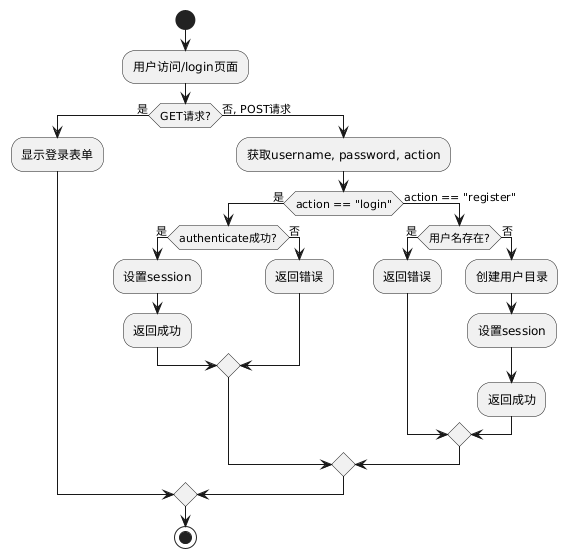
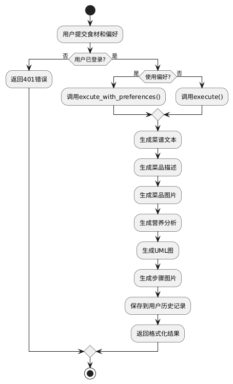
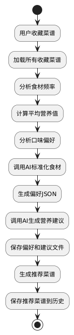

# 智能菜谱生成系统 - 系统建模报告

本报告从用例图、类图、序列图和状态图四个方面对“智能菜谱生成系统”进行系统建模，以清晰呈现系统的结构和行为。

---

## 1. 用例图（Use Case Diagram）

本系统的核心用户包括：普通用户与系统管理员。主要的交互行为有：提交原料、选择菜系、生成菜谱、查看历史记录、管理用户数据等。

### 用例说明：

- **提交原料**：用户可输入多个原料，系统进行解析。
- **选择菜系**：用户从系统提供的选项中选择菜系。
- **生成菜谱**：调用AI模型，生成结构化菜谱。
- **查看历史**：用户可浏览过往生成记录。
- **图像生成**：系统自动生成步骤图和成品图。
- **管理用户**：管理员可管理用户数据与权限（仅管理员可见）。

---

## 2. 类图（Class Diagram）

类图展示了系统中各类之间的结构关系，包括模型类、控制器、服务接口及数据对象等。

### 核心类说明：

- `User`：用户信息类，包含用户ID、历史记录、喜好等。
- `Recipe`：菜谱类，包含原料、风格、步骤、成品图等属性。
- `RecipeGenerator`：核心生成器类，调用语言模型生成菜谱结构。
- `ImageGenerator`：图像生成模块，生成步骤图与成品图。
- `RecipeService`：服务类，协调菜谱生成和数据返回。
- `DatabaseManager`：数据管理类，负责用户数据的存取。

---

## 3. 序列图（Sequence Diagram）

序列图展示了用户与系统之间生成菜谱的交互流程。

### 交互说明：

1. 登录与注册

- 用户访问首页（/），未登录会自动跳转到登录页面。
- 用户输入用户名和密码，点击登录或注册。
- 登录成功后进入主界面（index）。

2. 生成菜谱

- 在主界面输入主要食材，选择或输入烹饪风格。
- 可勾选“生成个性化食谱（根据我的健康偏好）”。
- 点击“生成菜谱”按钮，系统调用AI生成菜谱。
- 生成结果会显示菜谱名称、图片、营养分析、步骤、UML流程图等。
- 若菜谱中包含危险食材，会在菜谱名称上方高亮提示。

3. 收藏菜谱

- 每个生成的菜谱有“收藏”按钮。
- 点击后，显示“正在收藏...”提示，收藏成功后显示“已添加到收藏”。
- 收藏的菜谱会保存到个人中心的“我的收藏”列表。

4. 导出功能

- 支持导出菜谱为TXT、PDF、主菜图片、步骤图片ZIP等格式。

1. 个人中心（/profile）

- 显示用户的“我的收藏”和“历史记录”。
- 每个菜谱可单独删除。
- 历史记录支持“一键清空”。
- 页面顶部显示个人营养分析、详细建议、食材调整建议和健康小贴士（如有）。

---

## 6. 其他

- 若生成或收藏失败，会有相应提示。
- 所有操作需登录后进行，未登录会自动跳转到登录页。

---

如需详细某一环节的交互说明，请补充说明！

---

## 4. 状态图（State Diagram）

状态图反映了系统中“菜谱生成任务”的状态转换过程。

### 状态说明：

- **初始化**：用户提交生成请求，系统进入初始化状态；
- **准备中**：系统完成参数解析，开始任务排队；
- **生成中**：AI模型工作中，包括文字与图像生成；
- **完成**：结果生成完毕，用户可以查看；
- **失败**：任务中途异常或超时，系统标记失败状态。

---

## 5. 建模工具说明（可选）

以上图形由以下建模工具生成：

- UML建模工具推荐：StarUML / Visual Paradigm / draw.io
- 图像格式：PNG，分辨率建议 1080p 以上以确保清晰度
- 存储位置：建议与本 `.md` 文档位于同一目录下，便于渲染与共享

---

## 6. 小结

本系统通过UML建模清晰呈现出用户行为、类结构、执行流程及状态转移，后续可据此继续细化数据库设计与系统实现。该建模文档也将用于开发阶段作为设计参考文档。
